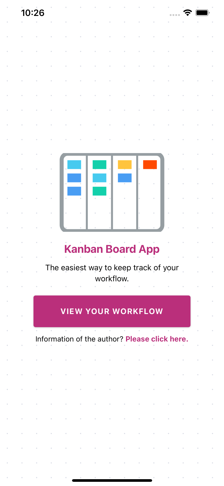
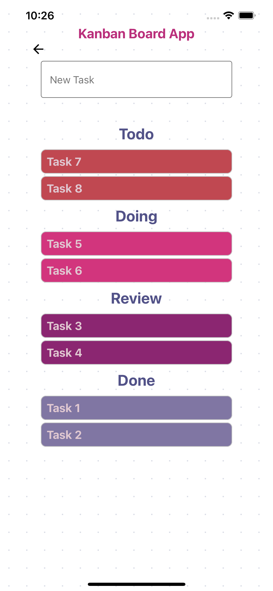
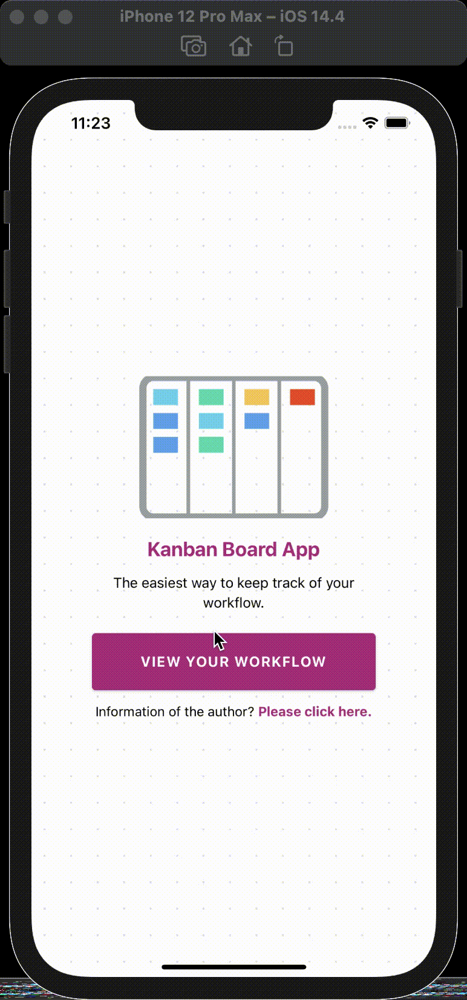

# Projet React Native SQLite (v1.0)

## Conception of project

This project is for the end project of the course Application Mobile. This app allows adding kanban tasks, marking them as doing, review or done, and deleting done items. The idea of this app came from [`SQLite` Todo List Exmple](https://github.com/expo/examples/tree/master/with-sqlite).

Thanks to `SQLite` features,  this app could create and open databases, create tables, insert items, querying and display results, and use prepared statements.

## Navigation of screens

There are a total of 3 screens in this app.

* Screen of start

* Screen of the kanban board

* Screen of profile

## Run the program

## Design inspiration

This project's design inspiration comes from a [React Native Template](https://reactnativemarket.com) by using a high-quality, standard-compliant Material Design library, `React Native Paper`.

## Simulator tested

iPhone 12 Pro Max - iOS 14.4

## Future word

Try to add `React Native Gesture Handler` for each task.
